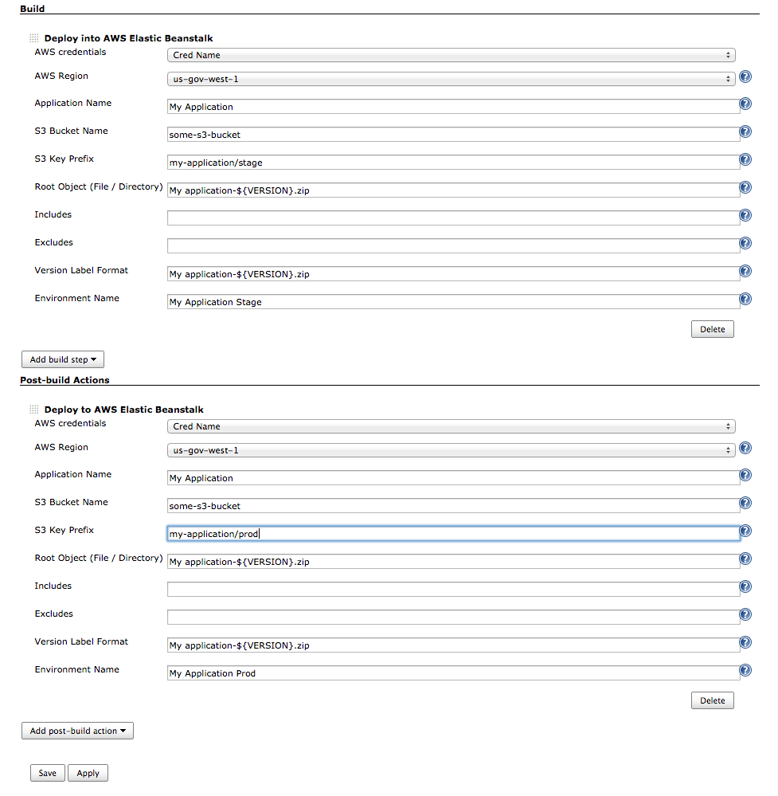

# Amazon Web Services Elastic Beanstalk Publisher

This plugin allows for publishing to an Elastic Beanstalk application as either a Build or Post Build step.  

Amazon credentials are set in the global configuration.  
If using an access key and secret key then the user needs to have IAM permissions to read and write to the desired S3 bucket, and needs permissions to update Elastic Beanstalk.  At the moment there is no ability to check to see that the version update was successful.

### Master status:

Screenshot: 

### Attribution

This is a fork of Aldrin Leal's [Elastic Beanstalk Deployment plugin](https://github.com/ingenieux/awseb-deployment-plugin)