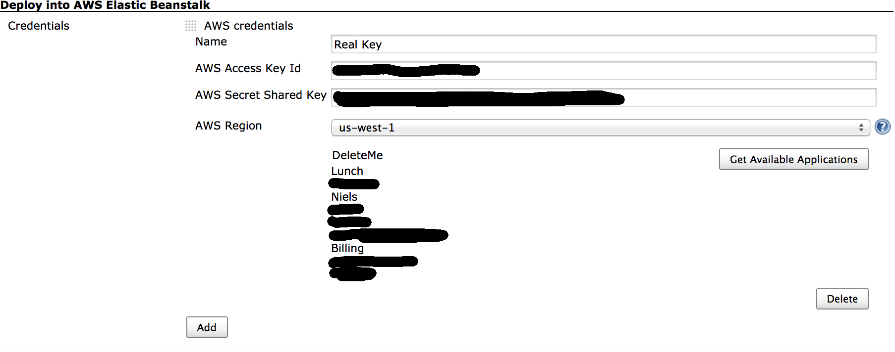
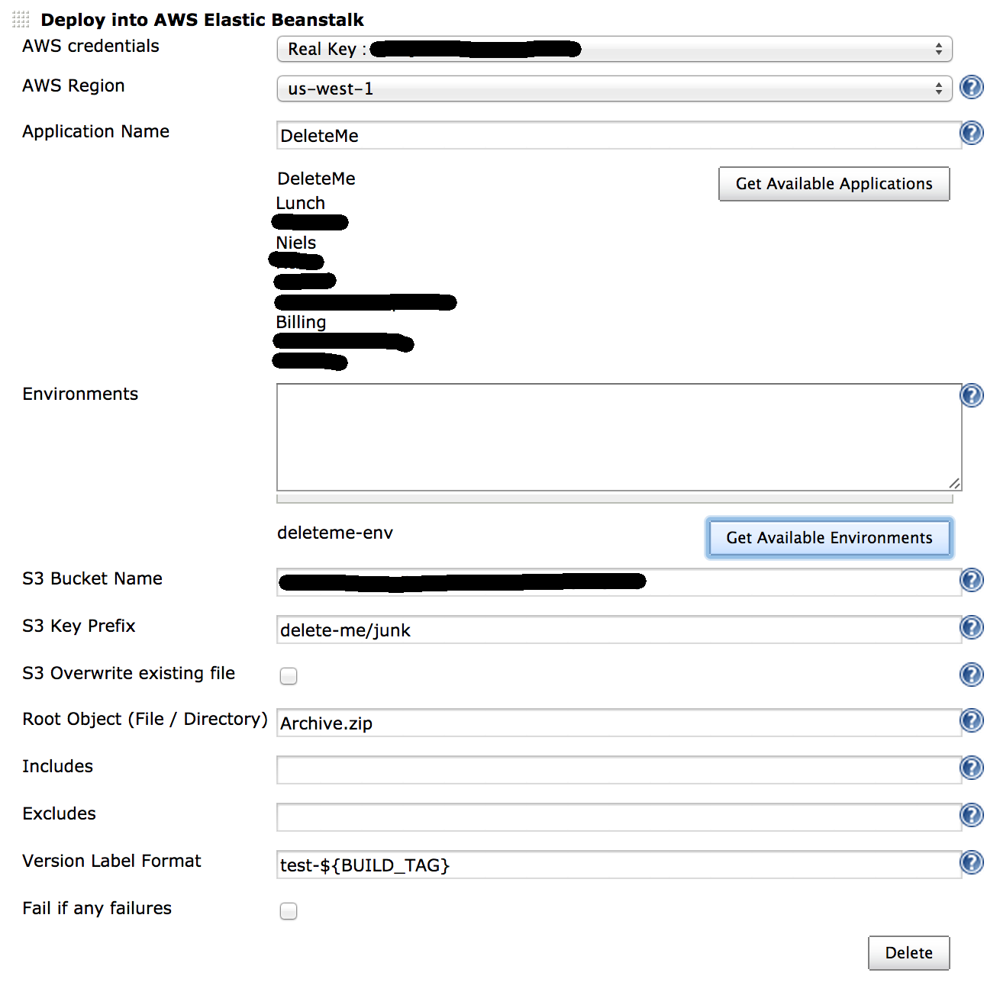

# Amazon Web Services Elastic Beanstalk Publisher


### Master status:

[](https://jenkins.ci.cloudbees.com/job/plugins/job/aws-beanstalk-publisher-plugin/)


This plugin allows for publishing to an Elastic Beanstalk application as either a Build or Post Build step.  

Amazon credentials are set in the global configuration.  
IAM credentials need to be able to read and upload to S3, and to read and configure Elastic Beanstalk.

#### Example Credentials
```json
{
  "Version": "2012-10-17",
  "Statement": [
    {
      "Effect": "Allow",
      "Action": [
        "elasticbeanstalk:*",
        "s3:*"
      ],
      "Resource": "*"
    }
  ]
}
```

After adding the Access Key ID and Secret Key in to the Jenkins master configuration, click Advanced and choose a region to see what applications your credentials actually see.

The Access Key and Secret Key are optional.  Credentials can be placed in the master configuration, in a .aws config file, or as environment variables.

If Jenkins is itself running inside AWS (for example on an EC2 instance) you can instead leave the Access Key ID and Secret Key blank, and the IAM instance role of the jenkins server will be used for authentication.
More about AWS credentials can be found [here](http://docs.aws.amazon.com/AWSSdkDocsJava/latest/DeveloperGuide/credentials.html).


####Screenshot:
##### Global Configuration 

##### Job Configuration



### Updates

#### -> 1.4.1
* Remove env lookups from the additional behaviors.

#### -> 1.4
* Changed the environment lookup to be an extension.
* Added a way to look up environments inside an application by url, eg. some-env.elasticbeanstalk.com

#### -> 1.3
* Fixed logic for printing log statements.
* Fixed issue where failed updates would never actually give up.

#### -> 1.2
* Added a print statement for events returned from AWS : BROKEN don't use

#### -> 1.0
* Multithreading the update environment process, in case there are multiple environments to be updated.
* Added test buttons to see which applications your credentials can see, both in the global and job config.
* Added a test button to see currently available environment names for the given application.
* Verify that environment completed updating.
* Bug fixes regarding duplicate AWS credentials.


### Attribution

This is a fork of Aldrin Leal's [Elastic Beanstalk Deployment plugin](https://github.com/ingenieux/awseb-deployment-plugin)
